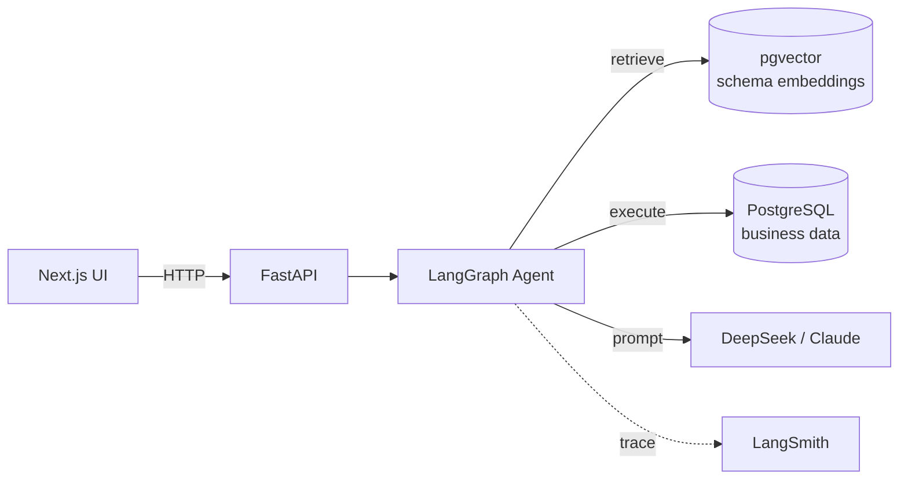

# Data Copilot

> An enterprise-grade **Text-to-SQL agent** with self-healing, schema-aware retrieval, and full observability.
> Built with **LangGraph**, **FastAPI**, **Next.js**, and **PostgreSQL + pgvector**.

[](#roadmap)
[](https://www.python.org/)
[](LICENSE)

---

## Why this project

Every analytics team has the same bottleneck: **business users wait days for the data team to write ad-hoc SQL**. Modern LLMs can close that gap, but production text-to-SQL is hard — schemas are huge, queries are wrong on the first try, and stakeholders need explanations, not just rows.

`data-copilot` is a portfolio-grade exploration of how to build that system *properly*: not a notebook demo, but a service with retrieval, validation, self-healing, evaluation, and traceable observability.

## Features

- 🧠 **LangGraph state machine** — multi-step reasoning with explicit retry / human-in-the-loop nodes
- 📚 **Schema-aware RAG** — embeds tables and columns; only the relevant slice of the schema is sent to the LLM
- 🔧 **Self-healing SQL** — when execution fails, the agent inspects the error and rewrites the query
- 📊 **Visualisation generation** — model picks chart type and config based on result shape
- 🔍 **Full observability** — every run traced in [LangSmith](https://smith.langchain.com/)
- ✅ **Evaluation harness** — fixed eval set + LLM-as-judge + RAGAS metrics, tracked per release
- 💸 **Cost-aware** — primary LLM is DeepSeek (~10× cheaper than GPT-4o); designed to swap providers via a single env var
- 🔒 **Safety** — query whitelist, row-level filters, automatic `LIMIT` injection

## Architecture



Full diagram and design notes in [`docs/architecture.md`](docs/architecture.md).
A line-by-line tour of the source lives in [`docs/code-walkthrough.md`](docs/code-walkthrough.md).
Major decisions are recorded as [ADRs](docs/decisions/).

## Tech stack

| Layer | Choice |
|-------|--------|
| Agent runtime | **LangGraph** + **LangChain** |
| LLM | DeepSeek-Chat (primary) · GPT-4o-mini · Claude Sonnet (benchmarked) |
| Embeddings | **SiliconFlow `BAAI/bge-m3`** (free tier) — swap-able via env var |
| Backend | FastAPI · Pydantic v2 · Python 3.11 |
| Database & vectors | PostgreSQL 16 · `pgvector` |
| Frontend | Next.js 15 · TypeScript · Tailwind · shadcn/ui |
| Tooling | `uv` · `ruff` · `mypy` · `pytest` |
| Observability | LangSmith |
| Container & deploy | Docker Compose → Fly.io |

## Quick start

```bash
# 1. Clone and configure
git clone https://github.com/rachel-zhang-dev/data-copilot.git
cd data-copilot
cp .env.example .env  # then fill in your API keys

# 2. Install dependencies (uv = fast package manager)
uv sync --all-extras

# 3. Boot Postgres
./scripts/dev.sh up

# 4. Run the API
./scripts/dev.sh api
# → http://localhost:8000/docs

# 5. Quick agent ping (no UI needed)
./scripts/dev.sh ask "Hello, who are you?"

# 6. Try a real data question (week 2 onwards)
./scripts/dev.sh ask "How many customers are there?"
./scripts/dev.sh ask "List the 5 most expensive products."
./scripts/dev.sh ask "Which country has the most customers?"

# 7. Schema-aware retrieval lets the agent handle JOINs (week 3)
./scripts/dev.sh ask "Which 5 products have the highest total revenue?"
./scripts/dev.sh ask "Which employees handled orders shipped to Germany?"
```

The `ask` command prints the SQL the agent generated, the rows it
fetched, and the natural-language answer — useful for debugging the
graph end-to-end. Unsafe inputs like `"Drop the orders table"` are
caught by the safety layer (see [ADR 0002](docs/decisions/0002-sql-safety.md)).

### Schema retrieval

Since week 3, the agent does not dump the entire schema into every
prompt. A retrieval node embeds your question, looks up the top-K
most relevant tables in pgvector, and expands the result one hop
along foreign keys — so `"top products by sales"` automatically
pulls in the bridge table `order_details` even though the question
never names it. See [ADR 0003](docs/decisions/0003-embedding-provider.md)
for why we picked SiliconFlow / BGE-M3.

The retrieval index is built automatically the first time you run
`./scripts/dev.sh up`. Rebuild manually with:

```bash
./scripts/dev.sh index --force   # full rebuild
./scripts/dev.sh index --check   # inspect current state, no writes
```

### Self-healing SQL

Since week 4, when generated SQL fails — either because the safety
layer rejected it (`unsafe_sql`) or because Postgres errored out
during execution (`execution_failed`) — the agent loops back to
`generate_sql` with the failed SQL and the error message in the
prompt, and the model takes another shot. Each error class has its
own retry budget (2 for execution failures, 1 for safety violations,
0 for everything else); see [ADR 0004](docs/decisions/0004-self-healing-policy.md).

The number of attempts is exposed in `AskResponse.attempts`. Pass
`?debug=true` to also receive the per-attempt failure history.

### Multi-turn dialogue

Since week 5, the agent supports follow-up questions. Pass an
existing `conversation_id` to continue a thread; omit it to start a
fresh one (the server allocates a UUID and returns it). State is
persisted to Postgres via LangGraph's `PostgresSaver`, so
conversations survive process restarts and span multiple replicas
behind a load balancer. See [ADR 0005](docs/decisions/0005-conversation-persistence.md).

```bash
# First turn: server allocates the conversation_id and returns it
curl -X POST http://localhost:8000/ask -H 'Content-Type: application/json' \
    -d '{"question": "How many customers are based in Germany?"}'
# => {"conversation_id": "abc-123", "turn_index": 1, "answer": "11", ...}

# Follow-up: the agent can now resolve "And France?"
curl -X POST http://localhost:8000/ask -H 'Content-Type: application/json' \
    -d '{"question": "And France?", "conversation_id": "abc-123"}'
# => {"conversation_id": "abc-123", "turn_index": 2,
#     "sql": "SELECT count(*) FROM customers WHERE country = 'France' LIMIT 100", ...}
```

When a conversation gets long enough to risk overflowing the LLM's
context window, a `compact_history_node` summarises the older turns
into a single synthetic entry. The threshold is configurable via
`COMPACTION_THRESHOLD_TOKENS` (default 4000). Per-turn retry
budgets reset between turns so a follow-up always starts fresh.

### Eval harness (week 6)

A reproducible A/B harness measures whether each Week 3-5 feature
actually moves the metrics. 32 hand-written cases × 4 metrics ×
3 A/B experiments yield committable markdown reports under
[`docs/eval/`](docs/eval/).

```bash
./scripts/dev.sh eval                          # all 3 experiments
./scripts/dev.sh eval --experiment schema_rag  # one A/B
./scripts/dev.sh eval --dry-run                # stdout only
```

The three experiments are `schema_rag`, `self_healing`, and
`dialogue_context` — each pairs the production default against a
"feature off" baseline so the per-feature contribution is visible.
See [ADR 0007](docs/decisions/0007-eval-methodology.md) for the
methodology and trade-offs (e.g. why deterministic graders, why not
RAGAS).

### Human-in-the-loop confirmation (week 7)

Since week 7, when the agent generates SQL whose Postgres planner
cost exceeds a threshold (default `1000.0`, tunable via
`RISK_EXPLAIN_COST_THRESHOLD`), the graph pauses **before** executing
and surfaces a `pending_confirmation` response. The caller answers
with `resume="approve"` or `resume="reject"` on the same
`conversation_id`, and the graph picks up at the interrupt point via
LangGraph's `Command(resume=...)` primitive — persisted through the
same `PostgresSaver` that powers multi-turn dialogue, so the pause
survives process restarts.

```bash
# 1) Ask an expensive question — the agent pauses
./scripts/dev.sh ask "Show me every order with every product and customer detail"
# => --- PENDING CONFIRMATION ---
#    reason:     Postgres planner estimated total cost 1234.5 ...
#    total_cost: 1234.5
#    threshold:  1000.0
#    --- SQL ---
#    SELECT ... FROM orders JOIN products ... LIMIT 100
#    conversation_id: abc-123

# 2a) Approve — the agent runs the SQL and answers
./scripts/dev.sh ask --cid abc-123 --resume approve

# 2b) Or reject — the turn finalises with "I did not run that query"
./scripts/dev.sh ask --cid abc-123 --resume reject
```

The same pause/resume mechanic is wired into the HTTP API via the
optional `resume` field on `POST /ask`. See
[ADR 0008](docs/decisions/0008-human-in-the-loop.md) for why the
planner cost (vs row-count heuristics or `EXPLAIN ANALYZE`), why
`interrupt()` over external queues, and the per-class threshold
tuning notes.

> **Note** &nbsp;The first `uv sync` downloads ~1 GB of wheels. Subsequent runs are instant.

## Roadmap

| Week | Milestone |
|------|-----------|
| 1 ✅ | Project scaffold, environment, hello-world LangGraph node |
| 2 ✅ | Single-table text-to-SQL baseline (no RAG yet) |
| 3 ✅ | Schema retrieval with pgvector (multi-table) |
| 4 ✅ | Refactor to full LangGraph state machine with self-healing |
| 5 ✅ | Multi-turn dialogue + chat history compaction |
| 6 ✅ | Evaluation set + 3 A/B experiments |
| 7 ✅ | Human-in-the-loop confirmation for expensive queries |
| 8 | Visualisation generation + insight summaries |
| 9 | Caching layer · cost report · retries with exponential backoff |
| 10 | Next.js front-end with streaming responses |
| 11 | Docker production image · Fly.io deploy · monitoring |
| 12 | Polish, demo video, blog series, simplify onboarding |

## Project layout

```
data-copilot/
├── apps/
│   ├── api/                # FastAPI + LangGraph backend
│   │   ├── copilot/        # importable Python package
│   │   │   ├── agent/      # LangGraph nodes, state, graph builder
│   │   │   ├── config.py
│   │   │   ├── llm.py
│   │   │   └── main.py     # FastAPI app
│   │   └── tests/
│   └── web/                # Next.js UI (added in week 10)
├── data/
│   └── seed/               # SQL fixtures (Northwind / TPC-H subset)
├── docs/
│   ├── architecture.md
│   └── decisions/          # ADRs — one .md per major decision
├── scripts/
│   └── dev.sh              # one-stop local commands
├── docker-compose.yml      # Postgres + pgvector
├── pyproject.toml          # managed by uv
├── .env.example
├── .gitignore
└── README.md
```

## Contributing

This repository is primarily a personal learning project. Issues and PRs are welcome — feel free to file an issue if anything is unclear or broken.

## License

[MIT](LICENSE) © 2026 Rachel Zhang
