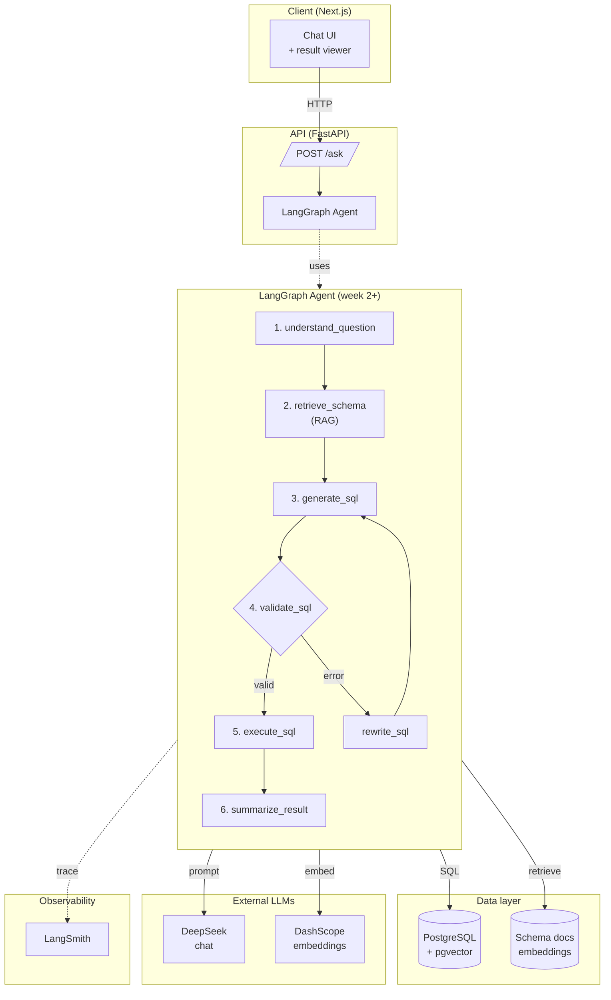

# Architecture

> Last updated: project bootstrap (week 1).

## High-level diagram

## Components

| Component | Tech | Purpose |
|-----------|------|---------|
| Frontend | Next.js 15 + Tailwind + shadcn/ui | Chat UI with streaming responses and result visualisation. (Wired up week 10.) |
| API | FastAPI + Pydantic v2 | Thin HTTP layer over the agent. |
| Agent runtime | LangGraph | State machine that orchestrates retrieval, generation, validation, and self-healing. |
| LLM | DeepSeek (chat) | Primary text-to-SQL and summarisation model. OpenAI-compatible API for portability. |
| Embeddings | DashScope `text-embedding-v3` | Cheap, high-quality embeddings for schema retrieval. |
| Vector store | pgvector inside Postgres | Co-locating data and embeddings simplifies ops; same connection pool. |
| Observability | LangSmith | Traces, evaluations, and regression dashboards. |

## Why LangGraph rather than plain LangChain?

Text-to-SQL is **not a single forward pass**. Real systems need to:

- branch ("is this a metadata question or a data question?"),
- loop ("the SQL failed; rewrite and try again"),
- pause for human approval (week 7),
- accumulate state (chat history, retry count, intermediate results).

LangChain's LCEL chains model a single linear data flow.
LangGraph models a **stateful directed graph**, which fits this problem
naturally and gives us first-class support for cycles, checkpointing,
and human-in-the-loop.

## Roadmap

See [`../README.md`](../README.md) for the 12-week plan.
Architectural decisions are recorded under [`./decisions/`](./decisions/).
