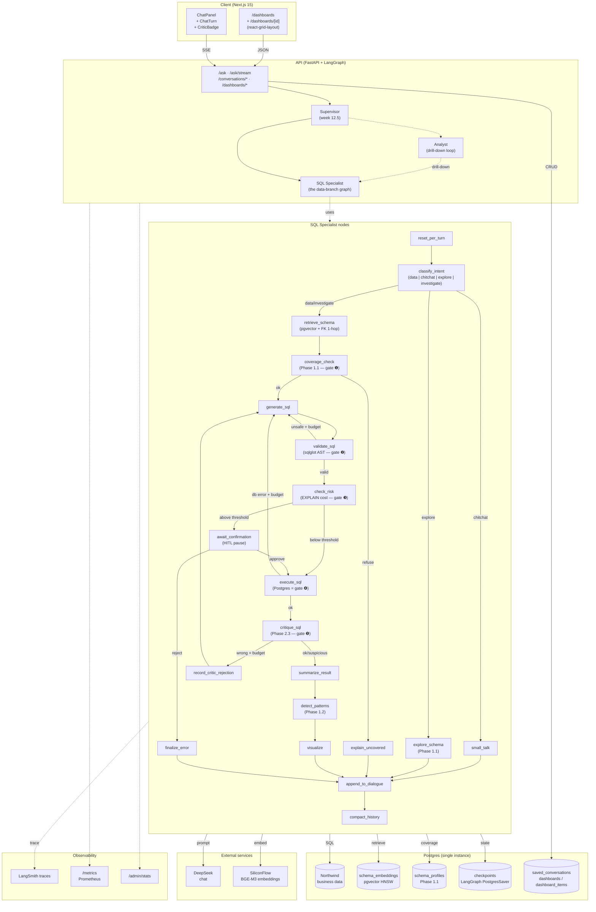

# Architecture

> Last updated: Phase 2.3.1 — 7-layer SQL defence, dashboards with snapshot model, multi-agent supervisor.

## High-level diagram

## The 7-layer SQL defence

The headline architecture decision: SQL correctness is **not** "trust
the LLM". It's **defence in depth**, with each layer catching a
different failure mode that the layers above can't.

| # | Layer | Module | Catches |
|---|---|---|---|
| ❶ | **Coverage gate** | `agent/coverage.py` (ADR 0016) | "DB can't answer this question" → refuses politely, no SQL written |
| ❷ | **Schema-aware RAG** | `agent/retriever.py` (ADR 0003) | "LLM hallucinates columns it can't see" — only top-K relevant tables + FK 1-hop are in-prompt |
| ❸ | **Static safety** | `agent/sql_safety.py` (ADR 0002) | "LLM emits INSERT/UPDATE/DROP" — sqlglot AST rejects non-SELECT at the root |
| ❹ | **Risk gate (HITL)** | `agent/risk.py` (ADR 0008) | "SQL is legal but expensive" — Postgres EXPLAIN cost > threshold → pause for human approve/reject |
| ❺ | **Self-healing retry** | `agent/nodes.py` retry branch (ADR 0004) | "SQL syntactically failed at runtime" — error fed back to LLM, bounded budget per class |
| ❻ | **Postgres** | `db.py:run_select` | Last line of defence — ground truth. Wrong SQL → error → reported honestly to the user |
| ❼ | **SQL critic** | `agent/critic.py` (ADR 0021) | "SQL ran fine but answered the WRONG question" — second LLM reviews verdict; `wrong` triggers one retry, `suspicious` surfaces a ⚠ low-confidence badge |

Layers ❶, ❷, ❼ are LLM-based (and themselves fail-soft). Layers ❸,
❹, ❺, ❻ are deterministic and bounded. The **eval harness** (ADR
0007) measures each layer's contribution to overall accuracy via 8
A/B experiments — every layer's value is a *measured number*, not a
claim.

## Components

| Component | Tech | Purpose |
|-----------|------|---------|
| Frontend | Next.js 15 + Tailwind v4 | Chat page + `/dashboards` index + detail page; SSE streaming + Route Handler proxies; react-grid-layout for grids; Vega-Lite for charts. |
| API | FastAPI + Pydantic v2 | Thin HTTP layer; CRUD for saved conversations + dashboards; SSE streaming endpoint; Prometheus metrics; `/admin/stats`. |
| Agent runtime | LangGraph 1.x | State machine; checkpointed multi-turn via `PostgresSaver`; `interrupt()` for HITL; supervisor + analyst sub-graphs. |
| LLM | DeepSeek (chat) | Primary text-to-SQL, summarisation, critic, coverage gate. OpenAI-compatible API for portability. |
| Embeddings | SiliconFlow `BAAI/bge-m3` | Free, OpenAI-compatible, multilingual SOTA. See [ADR 0003](decisions/0003-embedding-provider.md). |
| Vector store | pgvector (HNSW) | Co-located with business data; single Postgres pool. |
| Persistence | Postgres | Business data + vectors + LangGraph checkpoints + saved_conversations + dashboards + dashboard_items + schema_profiles. **Single store for everything.** |
| Observability | LangSmith + Prometheus + structured JSON logs | Traces (LangSmith), counters/histograms (`/metrics`), human dashboard (`/admin/stats`). |
| Deployment | Fly.io × 2 apps, multi-stage Docker | `data-copilot-api.fly.dev` + `data-copilot-web.fly.dev`, secrets via `fly secrets set`. |

## Capability matrix (end of Phase 2.3.1)

| Concern | Status | Notes / ADR |
|---|---|---|
| Intent classification | ✅ 4-way | `data` / `chitchat` / `schema_explore` / `investigate` ([0016, 0018]) |
| Schema RAG | ✅ | Top-K vector + named-table fast path + FK 1-hop + full-schema fallback |
| **Coverage gate** | ✅ Phase 1.1 | Schema profiles → "we can't answer this" refusal before SQL ([0016]) |
| SQL safety | ✅ | sqlglot AST single-SELECT + LIMIT injection ([0002]) |
| Self-healing | ✅ | Per-class per-turn budget; critic retries share the mechanism ([0004]) |
| **Risk gate (HITL)** | ✅ Week 7 | EXPLAIN cost → `interrupt()` → approve/reject ([0008]) |
| Visualisation | ✅ | 5 chart kinds picked deterministically; Vega-Lite v5 ([0009]) |
| Structured insight | ✅ | JSON envelope from summarizer; pydantic-validated ([0009]) |
| **Pattern detection** | ✅ Phase 1.2 | Outliers + trends in numpy; bullets merged into insight ([0017]) |
| **SQL critic** | ✅ Phase 2.3 | Post-execute LLM review; verdict drives retry / badge ([0021]) |
| Multi-turn dialogue | ✅ Week 5 | LangGraph `PostgresSaver` ([0005]) |
| History compaction | ✅ Week 5 | Threshold-driven, in-place reducer |
| **Multi-agent** | ✅ Week 12.5 | Supervisor + Analyst worker; intent-aware drill budget (2 for data, 6 for investigate) ([0014, 0018]) |
| Cost report | ✅ Week 9 | Per-turn breakdown reducer; surfaced on every response ([0010]) |
| Caching | ✅ Week 9 + 11 | TTL embedding cache; Redis swap by env var ([0010]) |
| Retry resilience | ✅ Week 9 | `tenacity` + LangChain `max_retries`; 429/5xx only |
| Streaming UI | ✅ Week 10 | SSE phase events; single Client Component owns chat state ([0011]) |
| **Saved conversations** | ✅ Phase 1.4 | One-click pin + sidebar drawer + inline rename + replay ([0019]) |
| **Dashboard cards** | ✅ Phase 2.1 + 2.1.1 + 2.3.1 | Snapshot model + 12-col grid + drag/resize/rename + back-link + critic preserved ([0020, 0021]) |
| **Back-link to source chat** | ✅ Phase 2.2 | `?conversation=<id>&turn=<n>` deep link from each card ([0020 §Phase 2.2]) |
| Deployment | ✅ Week 11 | Fly.io × 2; Prometheus `/metrics`; LangSmith traces ([0012]) |
| Eval harness | ✅ Week 6 + Phase 1.x + 2.3 | 50 cases × **8 A/Bs** (schema_rag, self_healing, dialogue_context, analyst, coverage_check, patterns_detection, investigate_mode, critic); markdown reports under [`./eval/`](eval/) ([0007]) |

## Why LangGraph rather than plain LangChain?

Text-to-SQL is **not a single forward pass**. Real systems need to:

- branch (4 intents in this build),
- loop (`generate_sql → validate → execute → critic → generate_sql`),
- pause for human approval (`interrupt()` / `Command(resume=...)`),
- accumulate state across nodes AND across turns (`PostgresSaver`),
- compose sub-graphs (multi-agent supervisor wraps the specialist).

LangChain's LCEL chains model a single linear data flow. LangGraph
models a **stateful directed graph** with first-class checkpointing
and HITL — that's the right shape for everything above.

## Roadmap

See [`../README.md`](../README.md) for the full week-by-week + Phase-by-Phase
plan. Architectural decisions live under [`./decisions/`](./decisions/) — 21
ADRs at time of writing, each with the alternatives explicitly rejected
recorded alongside the chosen path.
