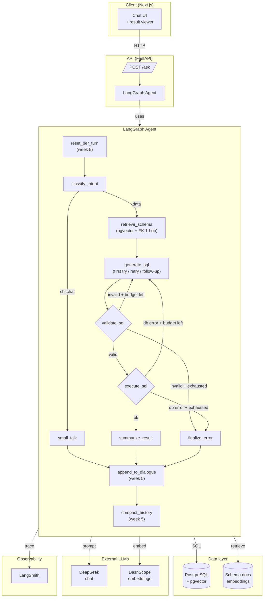

# Architecture

> Last updated: week 5 — multi-turn dialogue + chat history compaction with a Postgres checkpointer.

## High-level diagram

## Components

| Component | Tech | Purpose |
|-----------|------|---------|
| Frontend | Next.js 15 + Tailwind + shadcn/ui | Chat UI with streaming responses and result visualisation. (Wired up week 10.) |
| API | FastAPI + Pydantic v2 | Thin HTTP layer over the agent. |
| Agent runtime | LangGraph | State machine that orchestrates retrieval, generation, validation, and self-healing. |
| LLM | DeepSeek (chat) | Primary text-to-SQL and summarisation model. OpenAI-compatible API for portability. |
| Embeddings | SiliconFlow `BAAI/bge-m3` | Free, OpenAI-compatible, multilingual SOTA. See [ADR 0003](decisions/0003-embedding-provider.md). |
| Vector store | pgvector inside Postgres | Co-locating data and embeddings simplifies ops; same connection pool. |
| Observability | LangSmith | Traces, evaluations, and regression dashboards. |

## What is implemented today (end of week 5)

| Concern | Status | Notes |
|---|---|---|
| Intent classification (data vs chitchat) | ✅ | `classify_intent_node`; tiny prompt, `temperature=0` |
| Schema introspection | ✅ | `db.list_tables()` / `db.get_table_ddl(names)` |
| FK graph introspection | ✅ | `db.get_foreign_keys()` — used for 1-hop expansion |
| Schema embeddings | ✅ | `BAAI/bge-m3` via SiliconFlow → pgvector `schema_embeddings` (HNSW) |
| Schema retrieval (RAG) | ✅ | `retrieve_schema_node`: top-K vector search + named-table fast path + FK expansion + full-schema fallback |
| SQL generation | ✅ | `generate_sql_node`; switches between first-try and self-healing prompts; injects dialogue history for follow-ups |
| SQL safety / row cap | ✅ | sqlglot AST validation + auto `LIMIT` (see [ADR 0002](decisions/0002-sql-safety.md)) |
| SQL execution | ✅ | SQLAlchemy + psycopg3, sync pool managed in lifespan |
| Self-healing loop | ✅ | Per-class, **per-turn** retry budget; failures loop back to `generate_sql` until budget exhausts (see [ADR 0004](decisions/0004-self-healing-policy.md)) |
| Result summarisation | ✅ | `summarize_result_node`; rows JSON-previewed to LLM |
| Error finalisation | ✅ | Deterministic templates per error class; mentions attempt count |
| **Multi-turn dialogue** | ✅ | `conversation_id` keys a thread; LangGraph `PostgresSaver` persists state across calls (see [ADR 0005](decisions/0005-conversation-persistence.md)) |
| **History compaction** | ✅ | `compact_history_node` summarises older turns when dialogue tokens exceed threshold |
| **Eval harness** | ✅ | `copilot.eval` package; 3 A/B comparisons (schema_rag / self_healing / dialogue_context) with markdown reports under `docs/eval/`. See [ADR 0007](decisions/0007-eval-methodology.md) |

## Why LangGraph rather than plain LangChain?

Text-to-SQL is **not a single forward pass**. Real systems need to:

- branch ("is this a metadata question or a data question?"),
- loop ("the SQL failed; rewrite and try again"),
- pause for human approval (week 7),
- accumulate state (chat history, retry count, intermediate results).

LangChain's LCEL chains model a single linear data flow.
LangGraph models a **stateful directed graph**, which fits this problem
naturally and gives us first-class support for cycles, checkpointing,
and human-in-the-loop.

## Roadmap

See [`../README.md`](../README.md) for the 12-week plan.
Architectural decisions are recorded under [`./decisions/`](./decisions/).
