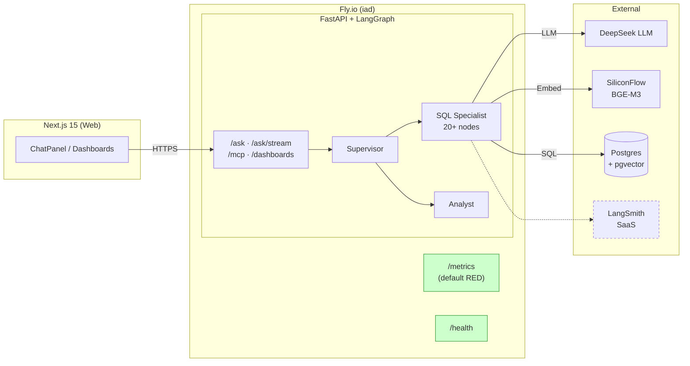

# W1-2 · 可观测性现状审计

> 这份文档是 13 周可观测性改造的起点。
> 配套 roadmap：[interview-notes/日志与Metric系统学习清单.md](https://github.com/rachel-zhang-dev/interview-notes/blob/main/日志与Metric系统学习清单.md)
>
> 目标：摸清 data-copilot 现在**有什么 / 缺什么 / 想监控什么**，给后续 12 周改造定基线。

---

## 一、项目快照

| 维度 | 现状 |
|------|------|
| 业务定位 | Enterprise Text-to-SQL Agent（自愈 / Schema-aware / 多智能体） |
| API 栈 | FastAPI 0.115 + Uvicorn + LangGraph 0.2 |
| Agent 拓扑 | Supervisor → SQL Specialist（20+ 节点）+ Analyst（drill-down loop） |
| LLM 提供方 | DeepSeek（OpenAI 兼容 API） |
| 向量与 Embedding | BGE-M3 via SiliconFlow（pgvector 存储） |
| 持久化 | Postgres + pgvector + langgraph-checkpoint-postgres |
| 缓存 | In-memory（默认）/ Redis（可选） |
| 前端 | Next.js 15 |
| 部署 | Fly.io（`data-copilot-rz-api`，region `iad`，scale-to-zero） |
| 协议扩展 | MCP server 挂在 `/mcp`（FastMCP v3） |

---

## 二、可观测性现状清单

### 2.1 ✅ 已有的（不少！）

| 能力 | 当前实现 | 评价 |
|------|---------|------|
| **HTTP 指标** | `prometheus-fastapi-instrumentator` 暴露 `/metrics` | ⭐ 基础够用：默认 RED 三件套（latency、status、in-flight）已自动埋点 |
| **LLM Tracing** | LangSmith（按需开启）| ⭐ 但是**厂商 SaaS**，且只覆盖 LangChain 调用链 |
| **健康检查** | `/health` 端点（用于 Docker / Fly healthcheck） | ⭐ 仅 liveness，无 readiness 分离 |
| **结构化日志库** | `structlog>=24.4.0` 在依赖里 | ⚠️ **装了但没启用** — 代码还在用标准 `logging.getLogger(__name__)` |
| **请求 ID 机制** | `conversation_id`（业务级） | ⭐ 但没有跨服务的 `trace_id` / `request_id` |
| **成本核算** | `cost.py` 的 `CostBreakdown`（per-turn LLM / embedding / DB 计费）| ⭐ 业务侧已有，**还没暴露成 Metric** |
| **错误处理** | FastAPI 全局异常 + `finalize_error` 节点 | ⭐ 但没接告警 |
| **部署可观测** | Fly.io 控制台 metrics | ⭐ 基础设施层够用，应用层缺 |

### 2.2 ❌ 缺失的

| 能力 | 缺失程度 | 优先级 |
|------|---------|------|
| 结构化日志（启用 structlog） | 100% | 🔴 W3 |
| TraceID 贯穿 / 跨节点透传 | 100% | 🔴 W3 / W10 |
| 自托管日志查询（Loki / ELK） | 100% | 🔴 W4-5 |
| 日志采样 / 冷热分层 | 100% | 🟡 W6 |
| 业务级 Metric（Token / Cost / Cache Hit / DB Latency） | 100% | 🔴 W7-8 |
| Prometheus + Grafana 自托管 | 100% | 🔴 W8 |
| 高基数治理（label 规范） | N/A（还没埋业务 metric） | 🟡 W9 |
| 分布式 Tracing（Jaeger / Tempo） | 100% | 🔴 W10 |
| **OpenTelemetry 统一接入** | 100% | 🔴 W11-12 |
| Tail Sampling | 100% | 🟡 W12 |
| SLI / SLO 定义 | 100% | 🟢 W13 |
| Multi-burn-rate 告警 | 100% | 🟢 W13 |
| 混沌实验联动 | 100% | 🟢 W13 |
| 前端 RUM | 100% | ⚪ 选做 |

---

## 三、业务关键模块（后续要重点观测的对象）

```
copilot/
├── main.py                  → HTTP 入口、CORS、middleware、/metrics、/health
├── llm.py                   → 🎯 LLM 调用（gen_ai.* 语义约定核心战场）
├── cost.py                  → 🎯 Token + Cost 业务 Metric
├── cache.py                 → 🎯 Cache Hit Rate / Size（Counter + Gauge）
├── db.py                    → 🎯 DB 查询延迟 / 连接池 USE
├── embeddings.py            → 🎯 Embedding 调用延迟 / 失败率
├── checkpointer.py          → Postgres checkpointer（持久化对话）
├── security.py              → Rate limit / API key middleware（错误率监控）
├── agent/
│   ├── graph.py             → 🎯 20+ LangGraph 节点（每个节点一个 Span）
│   ├── critic.py            → Self-heal 循环命中率
│   ├── retriever.py         → Schema 检索延迟
│   ├── sql_safety.py        → SQL AST 校验失败率
│   └── ...
├── agents/
│   ├── supervisor.py        → 路由决策
│   ├── sql_specialist.py    → 主 graph 包装
│   └── analyst/             → drill-down 子 graph
├── mcp_server.py            → MCP 协议端点（`/mcp/*`）
└── dashboards.py            → CRUD 端点
```

---

## 四、流量入口（埋点优先级）

| 端点 | 用途 | 业务关键度 | 当前观测 |
|------|------|----------|---------|
| `POST /ask` | 同步 Text-to-SQL | 🔴 P0（主入口） | HTTP metric ✅ |
| `POST /ask/stream` | SSE 流式（30-90s 长链接） | 🔴 P0 | HTTP metric ✅，但**长连接 metric 不准** |
| `POST /mcp/*` | MCP 工具调用 | 🟡 P1 | HTTP metric ✅ |
| `*/dashboards/*` | 仪表盘 CRUD | 🟢 P2 | HTTP metric ✅ |
| `*/conversations/*` | 对话历史 | 🟢 P2 | HTTP metric ✅ |
| `GET /health` | liveness | — | 已排除埋点 |
| `GET /metrics` | Prom 抓取 | — | 已排除埋点 |
| `GET /admin/stats` | uptime / 内部统计 | 🟢 P3 | HTTP metric ✅ |

---

## 五、现状架构图



**绿色 = 已有的观测能力**
**虚线 = 可选的 SaaS 观测**
**13 周后这张图会复杂很多**（OTel Collector + Tempo + Loki + Prom + Grafana + Alertmanager）

---

## 六、SLO 草案（W2 要敲定）

> 先列草案，根据真实流量观察一周再校准。

### 6.1 候选 SLI

| SLI | 计算公式 | 数据来源 |
|-----|---------|---------|
| **可用性** | `1 - (5xx / 总请求)` | HTTP metric |
| **`/ask` P99 延迟** | `histogram_quantile(0.99, http_request_duration_seconds)` | HTTP metric |
| **`/ask/stream` 首字节延迟（TTFB）** | 自定义 metric（W7 加） | 待埋点 |
| **LLM 调用成功率** | `1 - (llm_errors / llm_calls)` | 待埋点（W8） |
| **Critic 重试率** | `critic_rejections / total_turns` | 业务 metric（W7） |
| **单次对话成本** | `est_usd` per turn 的 P95 | `cost.py`（待暴露为 metric） |

### 6.2 SLO 草案

| 服务等级 | SLI | SLO | 30 天 Error Budget |
|---------|-----|-----|------------------|
| 关键路径 | `/ask` 可用性 | **99.5%** | 3.6 小时 |
| 关键路径 | `/ask` P99 延迟 | **< 5s**（非流式） | — |
| 流式 | `/ask/stream` 首字节延迟 P99 | **< 2s** | — |
| 业务 | 单次对话成本 P95 | **< $0.05** | — |
| 业务 | Critic 重试率 | **< 15%** | — |

⚠️ 这些数字现在都是**拍脑袋**的，W2 跑一周真实流量后再校准。

---

## 七、本周（W1-2）剩余任务

- [x] 现状审计（本文档）
- [ ] 把这份文档过一遍，挑出**最在意**的 3 个 SLO（其他先不管）
- [ ] 同步推进知识轨：读 roadmap 第二章「基础概念」
  - 三支柱、RED / USE、四个黄金信号
  - 推荐阅读：Google SRE Book Ch.6、Brendan Gregg 的 USE Method 原文
- [ ] （可选）跑一遍 [OTel Demo](https://github.com/open-telemetry/opentelemetry-demo) 先建立感性认识

## 八、下一步预告（W3）

把 `logging.getLogger` 替换成 **structlog**，加上 `request_id` / `conversation_id` / `trace_id` 三件套，敏感字段脱敏。

具体改动点（W3 开工前先列着）：
- `apps/api/copilot/main.py`：初始化 structlog 配置（JSON 输出）
- 加 `RequestIDMiddleware`（生成 / 透传 `X-Request-ID`）
- 每个 LangGraph 节点：把 `conversation_id` 绑到 `structlog.contextvars`
- prompt / SQL / 错误信息脱敏（避免 PII 泄漏）

---

*文档创建于 2026-06-07 · W1-2 起点 · 后续每周补充决策日志*
